Creating a new playlist
-----------------------

Once you have found the media that you require using the search tools, you can create a new playlist on the right hand side of the **Library** page. If it is not already open, click the **Open Media Builder** button to begin.

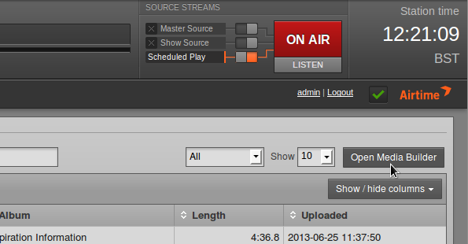

Then click the **New** button and select **New Playlist** from the pop-up menu.

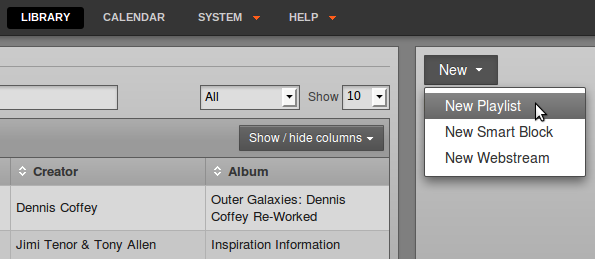

At first, the new playlist will be shown as *Untitled Playlist*. Click the pencil icon on the right to give the playlist a name.

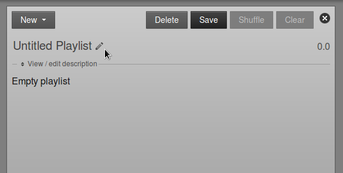

Type the name you have chosen, then press the **Enter** key on your keyboard to save the new name. You can edit the name of the playlist later, by clicking on the pencil icon again.

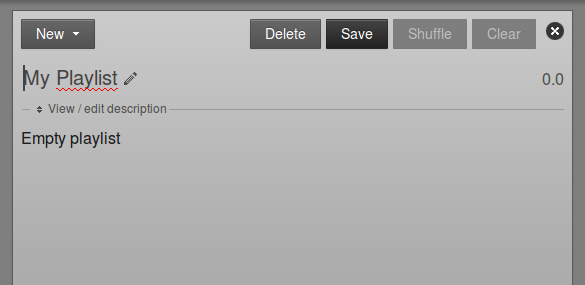

Click the link **View / edit description** to expand a box where you can enter a **Description** for the playlist, then click the **Save** button. Setting good quality metadata here will help you find the playlist using the search box later, so you should be as descriptive as possible.

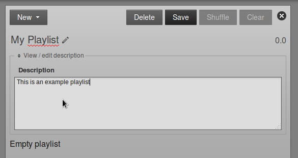

Adding content to a playlist
----------------------------

With a playlist open, click on an item in the search results and then click **Add to Playlist** on the pop-up menu. Or drag and drop items from the search results on the left into the playlist on the right. Jingles and voice tracks can be added before, after or between music items.

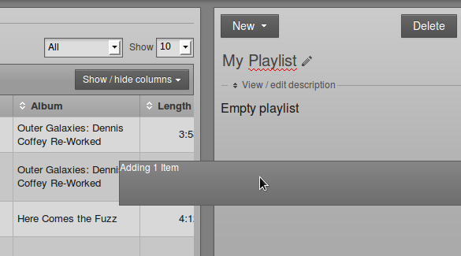

You can also select or deselect a whole page of search results using the **Select** button, just below the simple search field. Alternatively, use the checkboxes in the first column of the search results table to select individual items, then click the **Add to current playlist** button. Items that you own which you no longer require can be deleted from Libretime's library using the **Trashcan** button. 

After adding files to the playlist, the total playlist time is displayed in the top right corner. The duration of an individual file is shown in each row of the playlist in a white font, and beneath this figure the time since the beginning of the playlist is displayed in a smaller light grey font. This elapsed time figure can be used as a time check for voice tracks, although this option may limit the re-usability of the voice track.

To audition a playlist file in your web browser, click the white triangle**** button on the left side of its row. (If the format of the file is not supported by your browser, the triangle in this button will be greyed out). If audition of the file format is supported, a pop-up window will open, with the playlist starting at the file you clicked.

Click the small white **x** icon on the right hand side of each row to remove a file from the playlist. You can also drag and drop files to re-order them, or click the **Shuffle** button to re-order files automatically. Click the **Clear** button to remove all content from the playlist, or click the **Delete** button to remove the playlist from the Libretime library altogether.

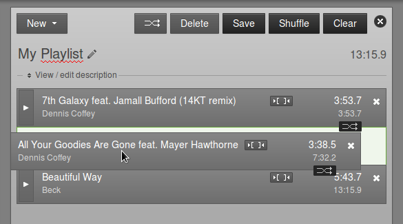

To adjust start and end fades, click the playlist **Fade** button (two horizontal white arrows crossing in a grey rectangle), to the left of the **Delete** and **Save** buttons. This action opens a beige bar in which you can set the **Fade in** duration for the first item in this playlist, and the **Fade out** duration for the last item. This duration figure represents the length of the fade, in seconds and tenths of a second, not the time at which the fade takes place. The default fade duration is set in the **Preferences** page on the **System** menu.

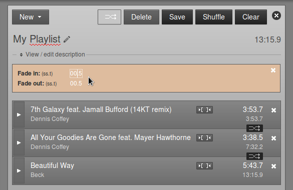

Click any one of the smaller **Fade** buttons between file rows to open another beige bar, which enables you to set **Fade out** and **Fade in** durations between two adjacent files in the playlist. The fade buttons for adjacent files change to an orange background when you click them.

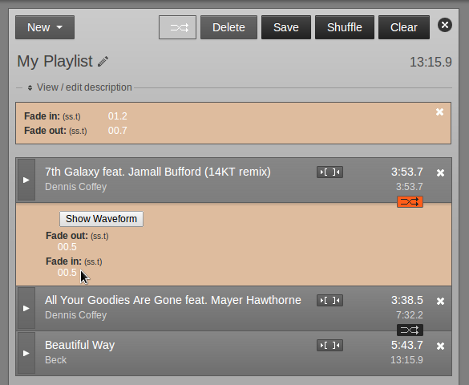

If your web browser supports the Web Audio API, you will see a **Show Waveform** button which enables you to view the waveforms of the adjacent items, adjust the fades and audition them. Click the **Fade Out** or **Fade In** button to change the fade curves by clicking in the waveforms, then click the **Play** button to audition the effect of any adjustment you have made. To audition just one part of the item, use the **Cursor** button to move the play cursor, which appears as a thin red line, on the waveform. The playback progress is shown by an orange colour on the waveform.

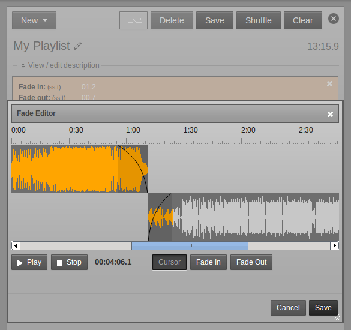

Each file in the playlist also has a button with two square brackets, which enables you to adjust **Cue In** and **Cue Out** times for that particular file. Like the fade button, the cue button changes to an orange background when you click it.

**Cue In** and **Cue Out** points are set in hours, minutes, seconds and tenths of a second, relative to the start of the item. If a file has leading or trailing silence, corresponding cue points will be set automatically. The duration of the file in the playlist is updated automatically when you adjust a cue point, but the **Original Length** of the file is also displayed for your reference.

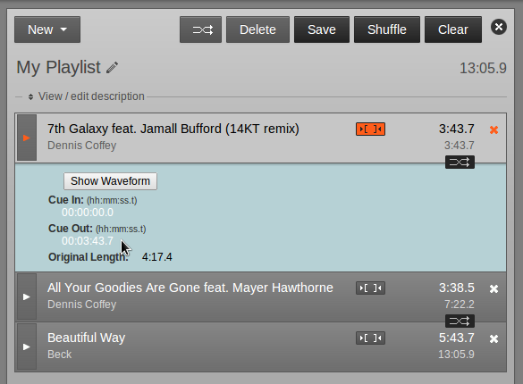

If a **Fade In** and **Cue In** are set on the same item in the playlist, the fade in begins at the **Cue In** point. If a **Fade Out** and **Cue Out** are set on the same item, the fade out ends at the **Cue Out** point. If your web browser supports the Web Audio API, you can click the **Show Waveform** button to adjust and audition cue points.

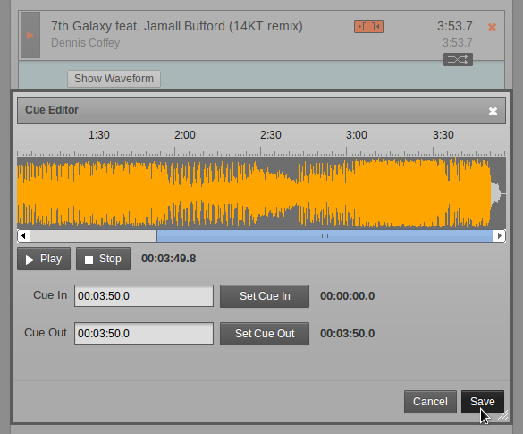

When your playlist is complete, click the **New** button in the top left corner to create another playlist, click the close icon (a white cross in a black circle) in the top right corner, or browse to another page of the Libretime interface.

If you want to edit the playlist content or metadata later, you can find it by **Title**, **Creator**, **Last Modified** date, **Length**, **Owner** or **Year** using one of the search tools on the Library page. Click the playlist in the search results list, and then click **Edit** from the pop-up menu. You can also **Preview** the entire playlist in a pop-up audition window, **Duplicate** or **Delete** one of your playlists from this menu.

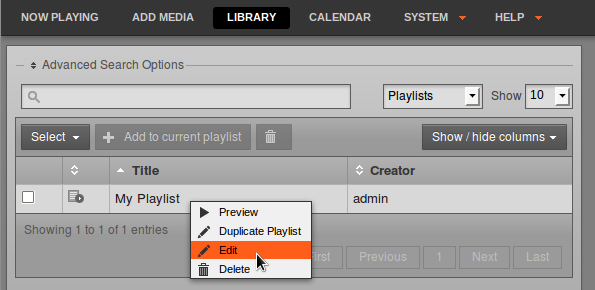

