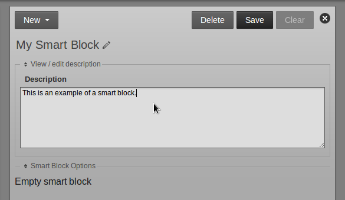
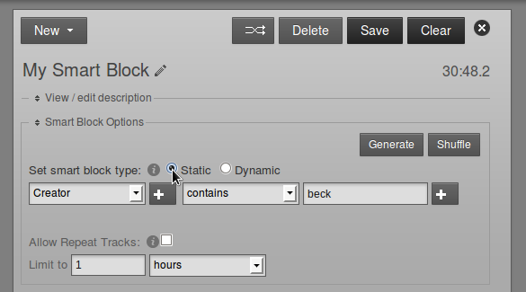
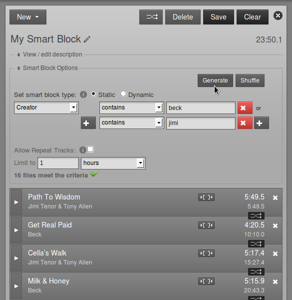
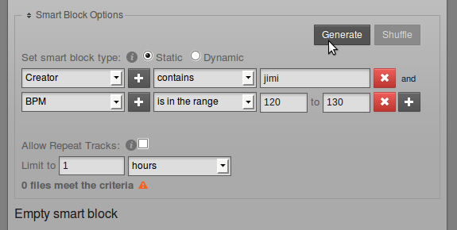
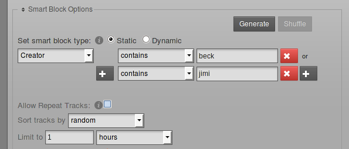
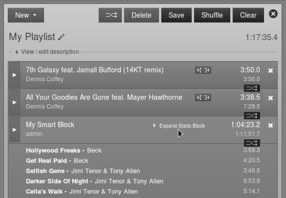

Creating a smart block
----------------------

Smart blocks are automatically filled with media files from the Libretime library, according to the criteria that you specify. This feature is intended to save staff time, compared to selecting items for a playlist manually.

To create a smart block, click the **New** button on the right side of the Library page, and select **New Smart Block** from the pop-up menu. Like a playlist, smart blocks can have a title and **Description**, which you can edit. This helps you find relevant smart blocks in searches.

Click the link **Smart Block Options** to display the criteria and modifiers for the smart block. The criteria can be any one of Libretime's metadata categories, such as **Title**, **Creator** or **Genre**. The modifier depends on whether the metadata in question contains letters or numbers. For example, **Title** has modifiers including *contains* and *starts with*, whereas the modifiers for **BPM** include *is greater than* and *is in the range*.

You can also set the **smart block type**. A **Static** smart block will save the criteria and generate the block content immediately. This enables you to edit the contents of the block in the **Library** page before adding it to a show. A **Dynamic** smart block will only save the criteria, and the specific content will be generated at the time the block is added to a show. After that, the content of the show can be changed or re-ordered in the **Now Playing** page. 

Click the **plus button** on the left to add OR criteria, such as **Creator** containing *beck* OR *jimi*. (The criteria are not case sensitive). For a static smart block, click the **Generate** button to see the results. Dynamic smart blocks do not display the **Generate** or **Shuffle** buttons.

If you don't like the ordering which is generated, click the **Shuffle** button, or drag and drop the smart block contents into the order that you prefer. You can also remove items or add new items manually from the Library. Changes to static smart block contents are saved automatically when you add items, remove or re-order them, or click the **Generate** button. Click the **Save** button in the upper right corner to save any changes to smart block criteria.

To add an AND criteria, such as **Creator** containing *jimi* AND BPM in the range *120* to *130*, click the **plus button** on the right. If you see the message **0 files meet the criteria** in this case, it might mean that the files in the Library have not been tagged with BPM metadata. See the chapter *Preparing media for ingest* for tips on tagging content.

By default, a smart block will not contain repeated items, which will limit the duration of the block if you do not have sufficient items meeting the specified criteria in your **Library**. To override the default behaviour, check the **Allow Repeat Tracks** box. The **Sort tracks by** menu offers the options of **random**, **newest** or **oldest** items first.

In addition Smart Blocks by default will never overflow the Time Limit. For instance if you set a time limit of 1 hour. It will add tracks to the schedule until it can't add any more tracks without exceeding the hour. This is to prevent tracks from being cut-off because they exceed the time limit of a show. 

If you want a smartblock to schedule tracks until it is longer than the Time Limit you can check "Allow last track to exceed time limit". This will make LibreTime add tracks that meet the criteria until it equals or is longer than the time limit. The was the default behaviour with the Libretime software.

If you have a large number of files which meet the criteria that you specify, you may wish to limit the duration of the smart block using the **Limit to** field, so that it fits within the show you have in mind. Select **hours**, **minutes** or **items** from the drop-down menu, and click the **Generate** button again, if it is a static smart block. Then click the **Save** button.

Smart blocks can be added to shows in the same way as a manually created playlist is added. Smart blocks can also be added to one or more playlists. In the case of a playlist containing a static smart block, click **Expand Static Block** to view the contents. For a dynamic smart block, you can review the criteria and duration limit by clicking **Expand Dynamic Block**.

Once created, smart blocks can be found in Library searches and refined at any time. They can be re-opened by clicking on the smart block and selecting **Edit** from the pop-up menu.

